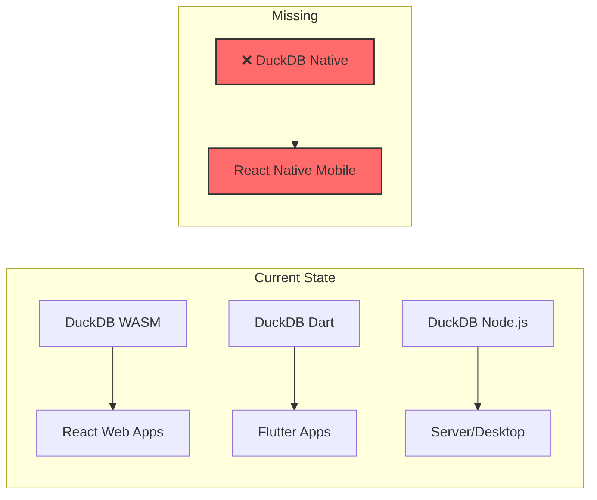
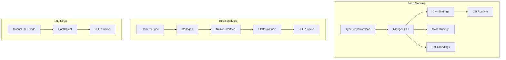
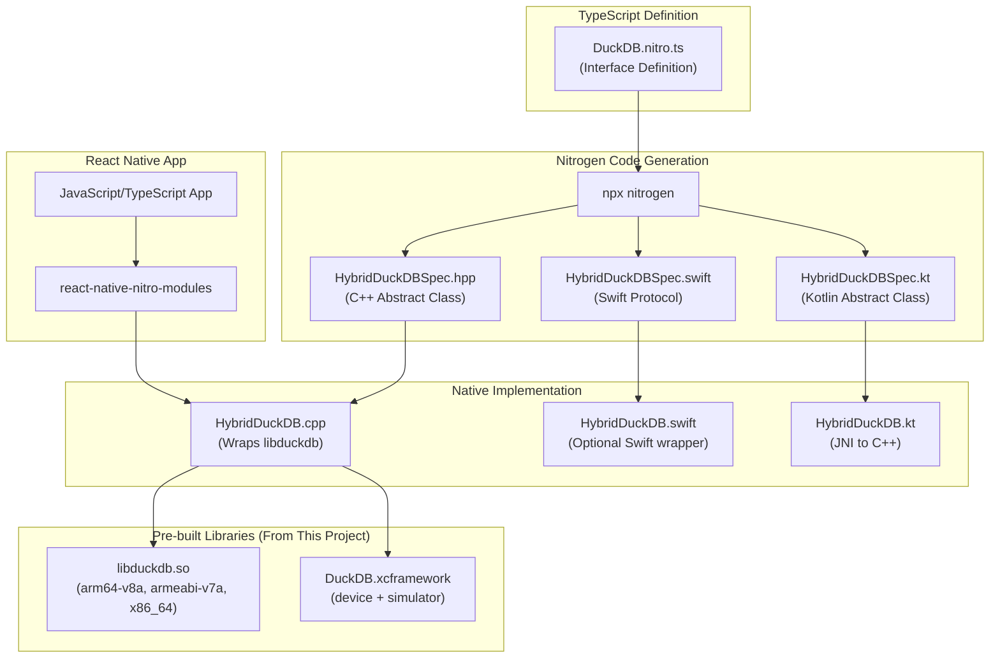
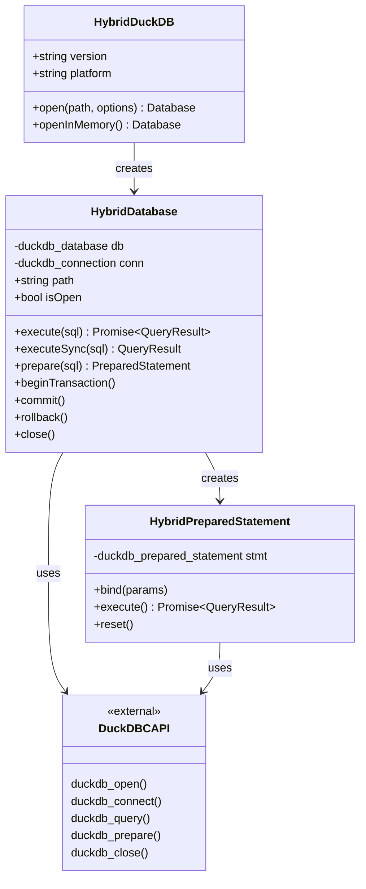
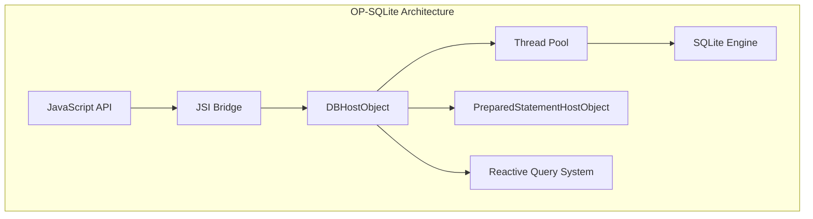
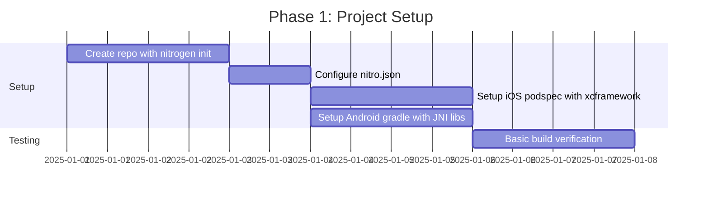
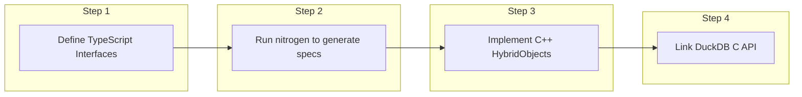
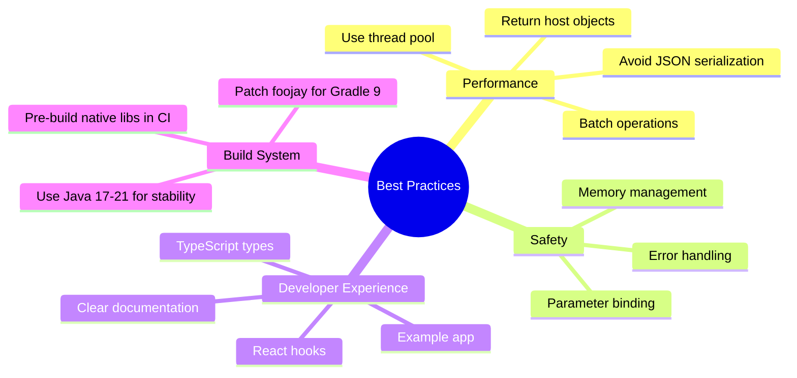

# React Native DuckDB - Native C++ Bindings Research & Recommendations

## Executive Summary

This document presents findings from researching modern C++ binding approaches for React Native, with the goal of creating a **native DuckDB module** for React Native (avoiding WASM). We can leverage the existing [build-android-libs.yml](.github/workflows/build-android-libs.yml) and [build-ios-framework.yml](.github/workflows/build-ios-framework.yml) workflows from this project to build the native libraries.

**Key Finding:** There is currently **NO existing React Native native DuckDB module**. This represents a significant opportunity.

---

## Table of Contents

1. [Current Landscape](#current-landscape)
2. [Framework Comparison](#framework-comparison)
3. [Recommended Approach: Nitro Modules](#recommended-approach-nitro-modules)
4. [Architecture Design](#architecture-design)
5. [Reference Implementations](#reference-implementations)
6. [Implementation Plan](#implementation-plan)
7. [Lessons Learned](#lessons-learned)

---

## Current Landscape

### What Exists Today

| Project                                                                    | Type             | Performance | Notes                       |
| -------------------------------------------------------------------------- | ---------------- | ----------- | --------------------------- |
| [@duckdb/react-duckdb](https://www.npmjs.com/package/@duckdb/react-duckdb) | WASM (Web only)  | Slower      | Not for React Native mobile |
| [duckdb-wasm-kit](https://github.com/holdenmatt/duckdb-wasm-kit)           | WASM (Web only)  | Slower      | React hooks for web apps    |
| This project (duckdb-dart)                                                 | Native (Flutter) | Fast        | Dart FFI, not RN compatible |

### Gap in the Market



---

## Framework Comparison

### React Native Native Module Options

| Framework         | Complexity | Performance | Code Generation               | Maturity    |
| ----------------- | ---------- | ----------- | ----------------------------- | ----------- |
| **Nitro Modules** | Low        | Fastest     | TypeScript → C++/Swift/Kotlin | New (2024+) |
| **Turbo Modules** | Medium     | Fast        | Codegen at build              | Mature      |
| **JSI Direct**    | High       | Fast        | Manual                        | Mature      |
| **Old Bridge**    | Low        | Slow        | None                          | Legacy      |

### Detailed Comparison



### Performance Benchmarks (from Nitro documentation)

| Operation         | Old Bridge     | Turbo Modules                         | Nitro Modules           |
| ----------------- | -------------- | ------------------------------------- | ----------------------- |
| 10,000 calls      | 1500ms         | module: module: module: ~module: 50ms | ~module: 5ms            |
| ArrayBuffer (8MB) | 666ms (base64) | 666ms (base64)                        | ~1ms (direct)           |
| Object creation   | Slow (JSON)    | Medium                                | Fast (C++ host objects) |

---

## Recommended Approach: Nitro Modules

### Why Nitro Modules?

1. **Best Performance**: Statically compiled JSI bindings with zero overhead
2. **Type Safety**: TypeScript interfaces generate type-safe native code
3. **Code Generation**: `nitrogen` CLI generates C++, Swift, and Kotlin from TypeScript
4. **Modern Swift Support**: Swift 5.9+ direct C++ interop (no Objective-C bridge)
5. **Maintained**: By [mrousavy](https://github.com/mrousavy) (VisionCamera author)
6. **Tooling**: `create-react-native-library` now supports Nitro template

### Nitro Architecture Overview



---

## Architecture Design

### Proposed Module Structure

```
react-native-duckdb/
├── src/
│   ├── index.ts                 # Public API exports
│   ├── specs/
│   │   ├── DuckDB.nitro.ts      # HybridObject interface
│   │   ├── Database.nitro.ts    # Database connection
│   │   ├── Result.nitro.ts      # Query results
│   │   └── PreparedStatement.nitro.ts
│   └── hooks/
│       └── useDuckDB.ts         # React hooks
├── nitrogen/
│   └── generated/               # Auto-generated bindings
│       ├── shared/c++/
│       ├── ios/swift/
│       └── android/kotlin/
├── cpp/
│   ├── HybridDuckDB.cpp         # Main implementation
│   ├── HybridDatabase.cpp       # Database wrapper
│   └── include/
│       └── duckdb.h             # DuckDB C API header
├── ios/
│   ├── DuckDB.xcframework/      # Pre-built framework
│   └── ReactNativeDuckDB.podspec
├── android/
│   ├── src/main/
│   │   ├── jniLibs/             # Pre-built .so files
│   │   │   ├── arm64-v8a/
│   │   │   ├── armeabi-v7a/
│   │   │   └── x86_64/
│   │   └── java/.../ReactNativeDuckDBPackage.kt
│   ├── build.gradle
│   └── CMakeLists.txt
├── nitro.json                   # Nitro configuration
└── package.json
```

### TypeScript Interface Design

```typescript
// src/specs/DuckDB.nitro.ts
import { HybridObject } from 'react-native-nitro-modules'

export interface QueryResult {
  columns: string[]
  rows: any[][]
  rowCount: number
  changesCount: number
}

export interface Database extends HybridObject<{ ios: 'c++'; android: 'c++' }> {
  // Database lifecycle
  readonly path: string
  readonly isOpen: boolean

  // Query execution
  execute(sql: string): Promise<QueryResult>
  executeSync(sql: string): QueryResult
  executeWithParams(sql: string, params: any[]): Promise<QueryResult>

  // Prepared statements
  prepare(sql: string): PreparedStatement

  // Transactions
  beginTransaction(): Promise<void>
  commit(): Promise<void>
  rollback(): Promise<void>
  transaction<T>(callback: () => Promise<T>): Promise<T>

  // Extensions
  loadExtension(path: string): Promise<void>

  // Lifecycle
  close(): void
}

export interface DuckDB extends HybridObject<{ ios: 'c++'; android: 'c++' }> {
  // Factory method
  open(path: string, options?: DatabaseOptions): Database
  openInMemory(): Database

  // Version info
  readonly version: string
  readonly platform: 'ios' | 'android'
}
```

### C++ Implementation Architecture



---

## Reference Implementations

### 1. OP-SQLite (Best Reference)

**Repository**: [OP-Engineering/op-sqlite](https://github.com/OP-Engineering/op-sqlite)

**Why study this:**

- Same use case (database library)
- High-performance JSI implementation
- Thread pool for async operations
- Reactive queries pattern
- Prepared statements
- BLOB/ArrayBuffer support

**Key Architecture Patterns:**



### 2. Nitro SQLite (Nitro-based reference)

**Repository**: [margelo/react-native-nitro-sqlite](https://github.com/margelo/react-native-nitro-sqlite)

**Why study this:**

- Uses Nitro Modules
- Direct successor to op-sqlite patterns
- Shows Nitro + database integration
- TypeScript-first API

### 3. VisionCamera (Complex C++ example)

**Repository**: [mrousavy/react-native-vision-camera](https://github.com/mrousavy/react-native-vision-camera)

**Why study this:**

- Complex C++ with JSI
- Frame processors pattern
- High-performance data handling
- Same author as Nitro

### 4. react-native-mmkv (Simple Nitro example)

**Repository**: [mrousavy/react-native-mmkv](https://github.com/mrousavy/react-native-mmkv)

**Why study this:**

- Now uses Nitro Modules (v4+)
- Simple, clean implementation
- Key-value store pattern
- Good starting template

---

## Implementation Plan

### Phase 1: Project Setup (Week 1)



**Steps:**

1. Initialize project:

   ```bash
   npx nitrogen@latest init react-native-duckdb
   # OR
   npx create-nitro-module react-native-duckdb
   ```

2. Configure `nitro.json`:

   ```json
   {
     "$schema": "https://nitro.margelo.com/nitro.schema.json",
     "cxxNamespace": ["duckdb"],
     "ios": {
       "iosModuleName": "ReactNativeDuckDB"
     },
     "android": {
       "androidNamespace": ["duckdb"],
       "androidCxxLibName": "ReactNativeDuckDB"
     },
     "autolinking": {
       "DuckDB": {
         "cpp": "HybridDuckDB"
       }
     }
   }
   ```

3. Copy pre-built libraries from this project's releases

### Phase 2: Core Implementation (Week 2-3)



**Core C++ Implementation Pattern:**

```cpp
// cpp/HybridDuckDB.cpp
#include "HybridDuckDB.hpp"
#include "duckdb.h"

namespace margelo::nitro::duckdb {

class HybridDuckDB : public HybridDuckDBSpec {
public:
    std::string getVersion() override {
        return duckdb_library_version();
    }

    std::shared_ptr<HybridDatabase> open(
        const std::string& path,
        const std::optional<DatabaseOptions>& options
    ) override {
        duckdb_database db;
        duckdb_config config;

        if (options.has_value()) {
            duckdb_create_config(&config);
            // Apply options...
        }

        auto state = duckdb_open_ext(path.c_str(), &db, config, nullptr);
        if (state == DuckDBError) {
            throw std::runtime_error("Failed to open database");
        }

        return std::make_shared<HybridDatabase>(db, path);
    }
};

} // namespace
```

### Phase 3: Advanced Features (Week 4)

- Prepared statements
- Transactions
- Async execution with thread pool
- ArrayBuffer for BLOB support
- Extension loading

### Phase 4: Testing & Documentation (Week 5)

- Unit tests
- Integration tests
- Example app
- API documentation
- Performance benchmarks

---

## Lessons Learned

### From OP-SQLite

1. **Thread Pool is Essential**: Database operations must not block the JS thread
2. **Reactive Queries**: Users love auto-updating queries
3. **Prepared Statements**: Critical for performance with repeated queries
4. **Host Objects**: Return C++ objects directly for large result sets

### From Nitro Modules

1. **TypeScript First**: Define interfaces in TypeScript, generate native code
2. **HybridObjects**: Use `jsi::NativeState` for efficient object lifecycle
3. **JSIConverter**: Handles type conversion automatically
4. **Swift 5.9+ Interop**: Direct C++ bridging without Objective-C
5. **Promise API**: Use `Promise<T>::async()` for async methods, not `std::future`

### From VisionCamera

1. **Complex Data**: Use ArrayBuffers for binary data
2. **Performance Critical**: Profile and optimize hot paths
3. **Error Handling**: Provide clear error messages from native

### From Implementation (December 2025)

#### Nitrogen/Nitro Specifics

1. **No `unknown` type**: Nitrogen doesn't support TypeScript `unknown`. Use explicit typed methods instead of generic `params: unknown[]`
2. **No empty structs**: Nitrogen requires at least one property in every struct. Instead of `type Row = Record<string, unknown>`, return JSON strings and parse on JS side
3. **Promise<T> not std::future<T>**: Nitro uses its own `Promise<T>` class. Use `Promise<T>::async([...]() { ... })` to create async promises:
   ```cpp
   std::shared_ptr<Promise<QueryResult>> execute(const std::string& sql) override {
     return Promise<QueryResult>::async([this, sql]() {
       return executeInternal(sql);
     });
   }
   ```

#### Gradle 9 + Java 25 Compatibility

1. **foojay-resolver-convention 0.5.0 breaks with Gradle 9**: React Native 0.83's `@react-native/gradle-plugin` uses `foojay-resolver-convention` version 0.5.0, which references `JvmVendorSpec.IBM_SEMERU` - removed in Gradle 9
2. **Fix**: Patch `node_modules/@react-native/gradle-plugin/settings.gradle.kts` to use version `1.0.0`:
   ```bash
   sed -i '' 's/version("0.5.0")/version("1.0.0")/g' \
     node_modules/@react-native/gradle-plugin/settings.gradle.kts
   ```
3. **Sources**:
   - [GitHub Issue #35596](https://github.com/gradle/gradle/issues/35596)
   - [React Native PR #54160](https://github.com/facebook/react-native/pull/54160)
   - [Medium Fix Guide](https://medium.com/@bebongnchuy/fixing-jvmvendorspec-ibm-semeru-and-java-25-errors-in-react-native-0-83-on-ubuntu-238b273cdb89)

#### XCFramework Creation

1. **Create from existing frameworks**: If you have separate device and simulator frameworks, use:
   ```bash
   xcodebuild -create-xcframework \
     -framework path/to/device/duckdb.framework \
     -framework path/to/simulator/duckdb.framework \
     -output DuckDB.xcframework
   ```

### General Best Practices



---

## Workflow Adaptation

### Adapting Existing Workflows

The existing workflows in this project can be adapted for React Native:

| Current Workflow          | Purpose                        | React Native Adaptation                    |
| ------------------------- | ------------------------------ | ------------------------------------------ |
| `build-android-libs.yml`  | Builds `libduckdb.so` for ABIs | Copy output to `android/src/main/jniLibs/` |
| `build-ios-framework.yml` | Builds `DuckDB.xcframework`    | Include in podspec                         |

### New Workflow: React Native Release

```yaml
# .github/workflows/build-react-native.yml
name: Build React Native Package

on:
  workflow_dispatch:
  release:
    types: [created]

jobs:
  build:
    runs-on: macos-14
    steps:
      - uses: actions/checkout@v4

      - name: Setup Node.js
        uses: actions/setup-node@v4
        with:
          node-version: '20'

      - name: Install dependencies
        run: |
          npm install

      - name: Download pre-built libraries
        run: |
          # Download from releases
          gh release download $DUCKDB_VERSION \
            --repo ${{ github.repository }} \
            --pattern "*.xcframework.zip" \
            --pattern "*.so"

      - name: Run nitrogen
        run: npx nitrogen

      - name: Build example app
        run: |
          cd example
          npm install
          npx pod-install

      - name: Publish to npm
        if: github.event_name == 'release'
        run: npm publish
        env:
          NODE_AUTH_TOKEN: ${{ secrets.NPM_TOKEN }}
```

---

## Resources & Links

### Documentation

- [Nitro Modules Docs](https://nitro.margelo.com/docs/what-is-nitro)
- [React Native New Architecture](https://reactnative.dev/docs/the-new-architecture/pillars-turbomodules)
- [JSI Cheatsheet](https://ospfranco.com/post/2023/08/15/jsi-cheatsheet-part-1-jsi/)
- [DuckDB C API](https://duckdb.org/docs/api/c/overview)

### Reference Repositories

- [mrousavy/nitro](https://github.com/mrousavy/nitro) - Nitro Modules framework
- [OP-Engineering/op-sqlite](https://github.com/OP-Engineering/op-sqlite) - Best SQLite reference
- [margelo/react-native-nitro-sqlite](https://github.com/margelo/react-native-nitro-sqlite) - Nitro + SQLite
- [patrickkabwe/create-nitro-module](https://github.com/patrickkabwe/create-nitro-module) - CLI template

### Tools

- `npx nitrogen@latest init <name>` - Initialize Nitro module
- `npx create-nitro-module <name>` - Alternative CLI
- `npx create-react-native-library` - With Nitro template option

---

## Conclusion

**Recommended Path Forward:**

1. **Use Nitro Modules** as the framework - best performance, modern tooling
2. **Reference op-sqlite** for database-specific patterns
3. **Leverage existing workflows** for building native libraries
4. **Start with core features** (open, execute, close) then expand

This approach will create the first native DuckDB module for React Native, filling a significant gap in the ecosystem while leveraging the excellent foundation already built in this project.

---

_Document generated: December 2025_
_Based on research of Nitro Modules, OP-SQLite, and React Native New Architecture_
